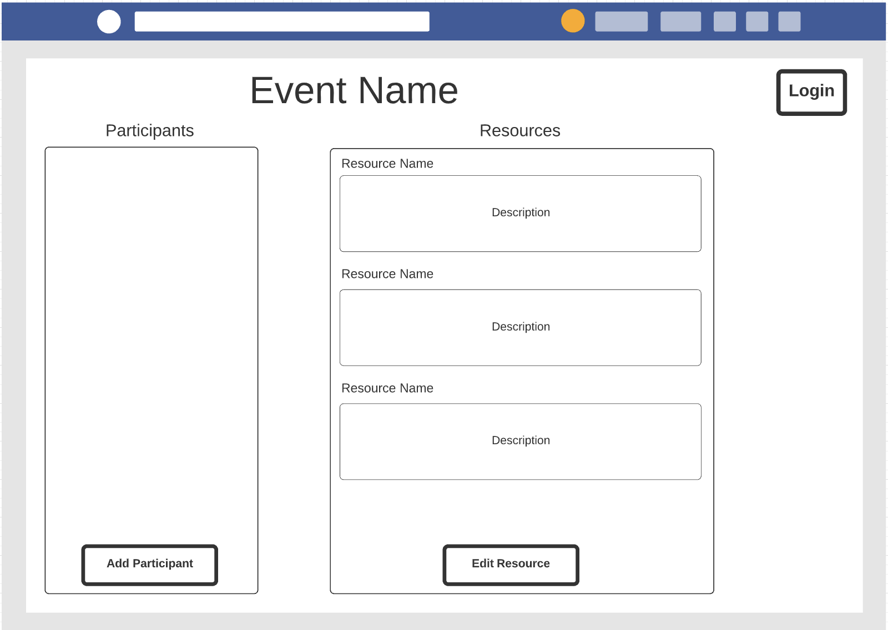

# Event resource app

## Introduction
This is an application that event organizers can use to share resources with event participants.

## Storyboard

## User stories

* As a user I want to log in to the system
* As an event organizer I want to register more users so that they can also log in
* As an event organizer I want to create resources for the event that everyone can see
* As a participant I want to be able to see the resources

## Classes

### Models
#### User

#### Resource

### Services
#### UserService

#### ResourceService

### Unit Tests

* If event is trying to be created at a past date: Return error, tell user to select future date.
* If event is being created for current day or future day: Return succuss, create event and update database.
* If user it trying to access a share link for a past event: Return error, unable to accept invitation for an event that already occurred.
* If user is trying to access share link for future or current event: Return success, add user to event roster and update database as needed.
* If an event organizer creates an event: Return success, update database with new event.
* If a standard user creates an event: Return error, only event organizers can create events. 

## Scrum Roles

* Jack Barr - Product Owner
* Justin Tran - Scrum Master
* Dev Agrawal - Developer
* Colin Vitols - Developer
